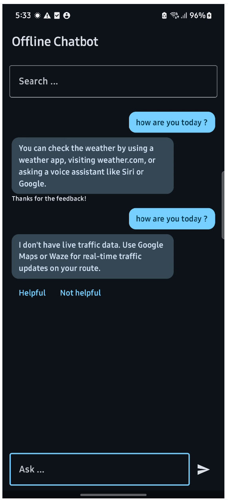
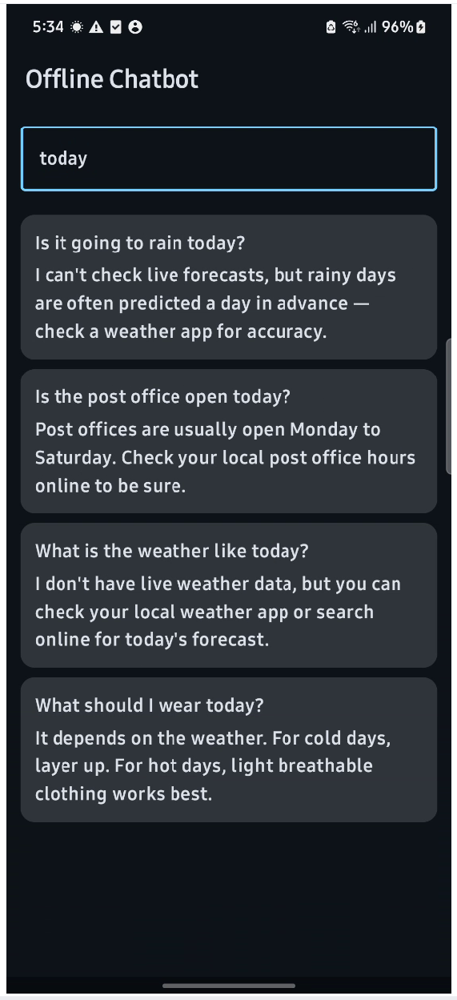
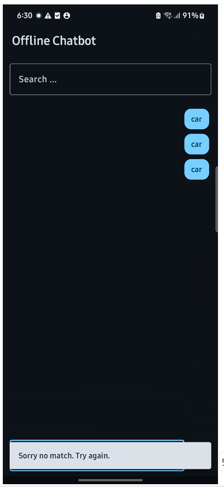

# SmartChatBot

A fully offline Android chatbot app built with Jetpack Compose, Room, and MVVM/MVI architecture.

## Screenshots

  
  
  
  

## How to run

1. Clone the repo
2. Open in Android Studio
3. Run on any device or emulator with API 26+

## How matching works

- User query is split into words
- Each stored question is checked for how many of those words it contains
- The entry with the most matches wins
- If nothing matches, a snackbar message is shown instead of guessing

## Why keyword matching

Simple to implement and good enough for a 50-entry offline dataset.
The matcher sits behind an interface, so swapping in TF-IDF or fuzzy matching later requires no changes to the rest of the app.

## How feedback improves matching

- Positive feedback adds 0.1 to the entry's weight
- Negative feedback subtracts 0.1 from the entry's weight
- Weight is persisted in Room so it survives app restarts
- Higher weight means the entry ranks higher in future matches

## What I'd improve with more time

- Add TF-IDF or fuzzy matching as an alternative strategy
- Better fallback when no mach is available.
- More unit tests covering edge cases.

## Syncing learned feedback across devices

The questions and answers never need to sync - they are already bundled in the app on every device. The only thing that needs to sync is the weight value per entry, which is just a number tied to an ID.

- Store a simple map of `{ entryId: weight }` in Firebase Firestore under the user's account
- On a new device, pull the map down and apply the weights on top of the local database

